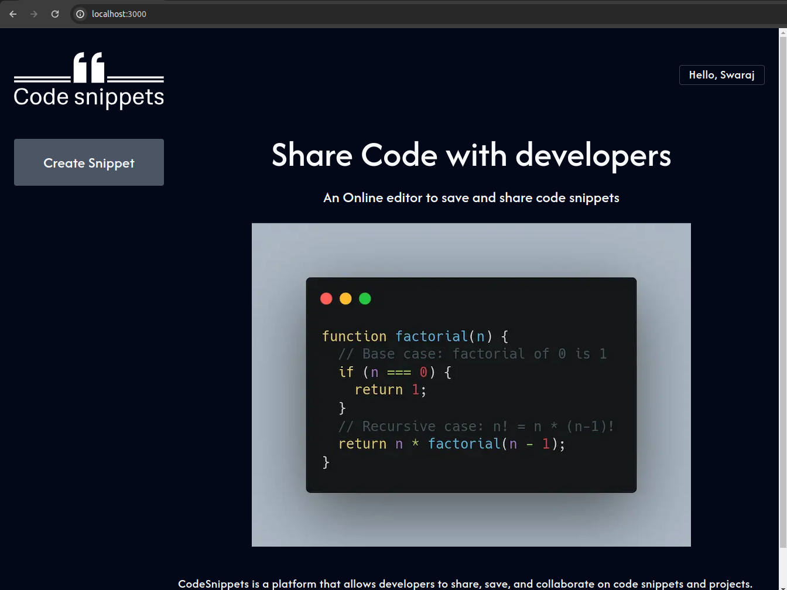
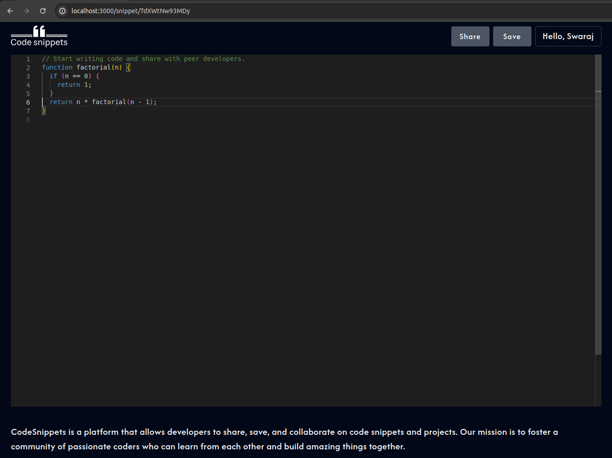
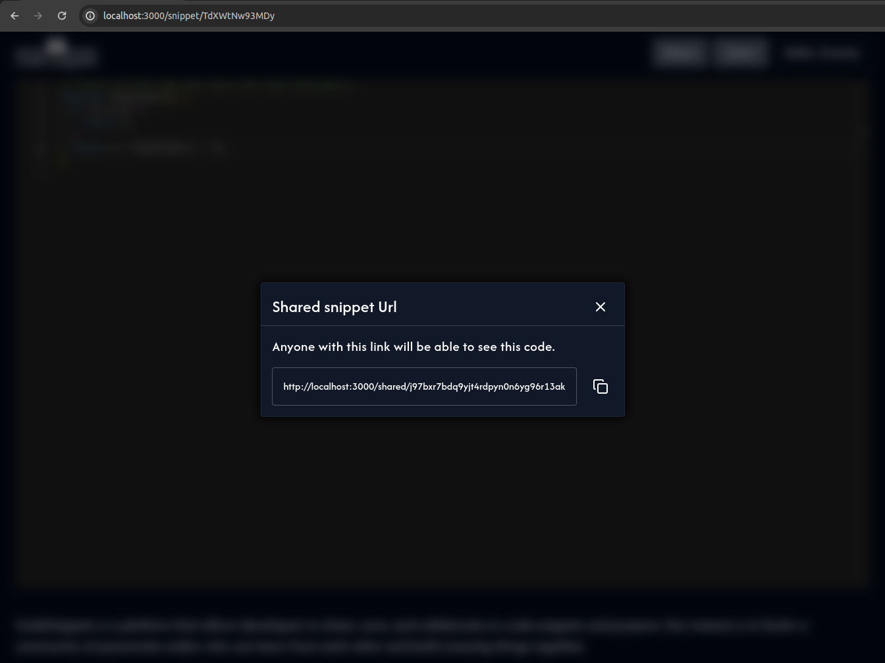

# CodeSnippets

CodeSnippets is a platform that allows developers to share, save, and collaborate on code snippets and projects.

# Tools used

[Next.js](https://nextjs.org/)  
[React.js](https://nextjs.org/)  
[Monaco Editor](https://www.npmjs.com/package/@monaco-editor/react)  
[Convex](https://www.convex.dev/)  
[Shadcn](https://ui.shadcn.com/)  
[Lucide React](https://lucide.dev/guide/packages/lucide-react)  
[Tailwind](https://tailwindcss.com/)

# How to use

Clone this repository using

```bash
git clone git@github.com:Swaraj-Deep/codesnippets.git
```

Once the repository is cloned run following commands

```bash
yarn dev
```

This will run the `Next.js` server.

```bash
npx convex dev
```

This will run the `convex` development server.

# Current Functionalities

Curently `CodeSnippets` offers you to create a snippet. Save the snippet and also share the snippet. You need an account though to save the snippet.

# Current Archietecture

Current Archietecture is very simple. The UI is made in React.js using Next.js as SSR framework. The API Layer is integrated in Next.js only where the request is sent to `convex` to save the data in database.

# Screenshots







# Futrue Scope

We will introduce live code sharing which will increase collaboration among developers. Also we will integrate live code execution module to quickly verify the code. Backed needs to be moved out of Next.js framework.
